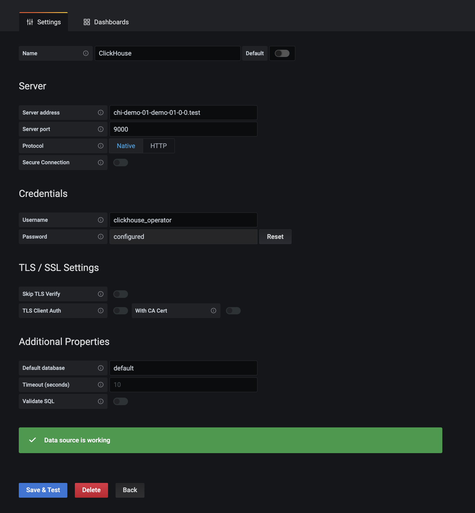
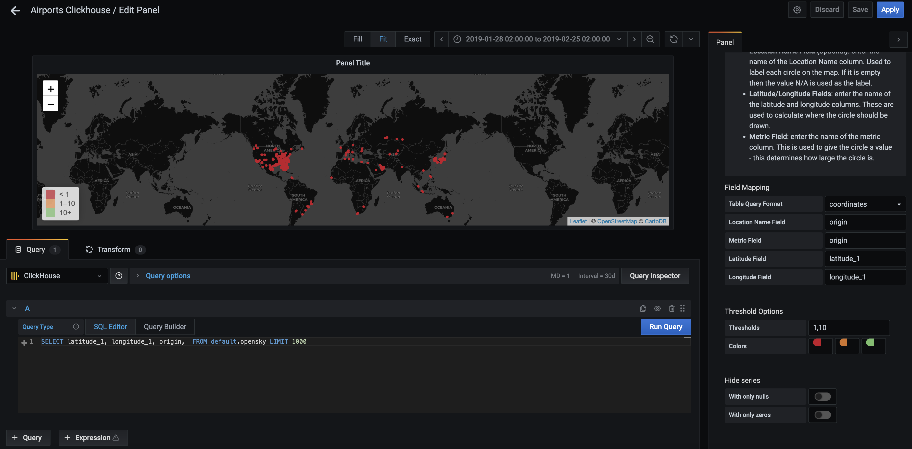

## Лабораторна робота
###  Візуалізація даних із OLAP бази даних CLickhouse

### Інсталювати microk8s
За посиланням нище встановити microk8s взалежності від вашої операційної системи виконашви необхідні команди. 
https://microk8s.io/


Інсталяцію можна перевірити наступною командою:
```
microk8s kubectl get pods -A
```

### Налаштування microk8s
Встановити базові компоненти microk8s, що необхідні для роботи.
```
microk8s enable  metrics-server dns storage prometheus
```
* dns: розгортання CoreDNS. Цей компонент є обов'язковим для більшості, тому рекомендова, щоб він був завжди активований.
* metrics-server: додає Kubernetes Metrics Server до API  для доступу до сервісних метрик.
* storage: створює клас сховища, що буде використовувати дисковий простір локальної машини.
* prometheus: розгортання Prometheus Operator-а.

Через 5 хв перевірити їх готовність:
```
✗ microk8s kubectl get pods -A
NAMESPACE     NAME                                         READY   STATUS    RESTARTS         AGE
kube-system   kubernetes-dashboard-869949b85-7vjgd         1/1     Running   6 (6m22s ago)    2d2h
monitoring    prometheus-operator-7775c66ccf-nbj59         2/2     Running   12 (6m22s ago)   7d3h
monitoring    node-exporter-dnjct                          2/2     Running   12 (6m22s ago)   7d3h
monitoring    prometheus-adapter-59df95d9f5-52chj          1/1     Running   6 (6m22s ago)    7d3h
monitoring    kube-state-metrics-76f6cb7996-qd4xg          3/3     Running   18 (6m22s ago)   7d3h
monitoring    blackbox-exporter-55c457d5fb-xkjxz           3/3     Running   18 (6m22s ago)   7d3h
kube-system   dashboard-metrics-scraper-58d4977855-4p9qz   1/1     Running   6 (6m22s ago)    2d2h
monitoring    prometheus-adapter-59df95d9f5-xzk5g          1/1     Running   6 (6m22s ago)    7d3h
kube-system   metrics-server-85df567dd8-q5lbc              1/1     Running   6 (6m22s ago)    2d2h
******
```
Cтатус  "Running" означає, що компонент готовий.

### Налаштування grafana-и
Прокинути сервіс графани на локальну машину:
```
microk8s kubectl port-forward svc/kube-prom-stack-grafana 3000:80 -n observability
```

Grafana буде доступна за посиланням http://localhost:3000/ . 
Дефолтний пароль:
```
login: admin
password: admin
```
Ознайомитись із UI.  
Завдання:
Додати себе(Ваше прізвище та ім'я) як нового користувача.


#### Вставнолення clickhose data source плагіну:

Data source плагіни відповідають за комунікацію між сторонніми ресурсами і повертають дані в форматі, який буде зрозумілий grafana-і.
Додаючи data source plugin, ви можете використовувати дані в будь якій дашборді. 

Встановити plugin можна як із допомогою grafana-cli так із допомогою UI.
```
microk8s kubectl get pods -A # для того аби отримати список всіх подів, що запущені в кластері
microk8s kubectl exec -it <grafana-назва поду> -n observability  -c grafana -- /bin/bash
grafana-cli plugins install grafana-clickhouse-datasource
```
Після запуску команди наявність плагіну слід перевірити в UI http://localhost:3000/ . 

https://grafana.com/grafana/plugins/grafana-clickhouse-datasource/?tab=installation

### Інсталяція clickhouse.
https://docs.altinity.com/clickhouseonkubernetes/kubernetesquickstartguide/quickstartinstallation/


```
microk8s kubectl apply -f https://github.com/Altinity/clickhouse-operator/raw/0.18.3/deploy/operator/clickhouse-operator-install-bundle.yaml
microk8s kubectl create namespace test

microk8s kubectl apply -f https://raw.githubusercontent.com/kuzm1ch/database_labs/feat/clickhouse/clickhouse/clickhouse.yaml
microk8s kubectl get all -n test # перевірка
```
Дефолтний логін та пароль
```
Default Username: clickhouse_operator
Default Password: clickhouse_operator_password
```

### Завантажння даних (dataset)

https://clickhouse.com/docs/en/getting-started/example-datasets/opensky

```
microk8s kubectl -n test exec -it chi-demo-01-demo-01-0-0-0 -- /bin/bash
```

https://docs.altinity.com/integrations/clickhouse-and-grafana/grafana-create-charts/ - те чого треба досягти, а саме візалізувати дані для потреб моніторингу(у випадку, якщо б дані в БД поступали постійно) та аналітики

```
kubectl -n test exec -it chi-demo-01-demo-01-0-0-0 -- clickhouse-client
SELECT formatReadableSize(total_bytes) FROM system.tables WHERE name = 'opensky';
```

### Підключення grafana


