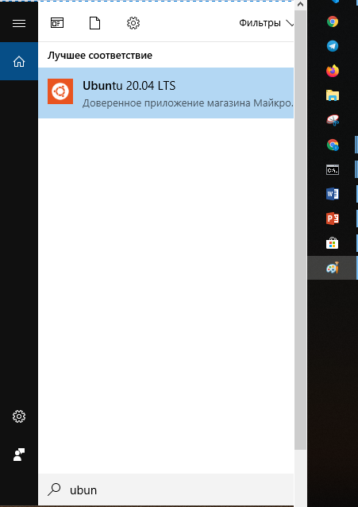

## Лабораторна робота №1
### Знайомство із Redis

Мета: знайомство із розподіленим сховищем Redis та його інсталювання, області використання та базових операції в командній строці з допомого rediscli. Знайомство із типами даних строки і хеши(словники).  

В дуже загальному Redis є сховище типу ключ значення, яке тримає дані в оперативній пам’яті та зберігає їх на диск для забезпечення надійності. 
https://uk.wikipedia.org/wiki/Redis

Перед початком роботи потрібно опрацювати книгу [“The Little Redis Book”](https://github.com/akandratovich/the-little-redis-book/tree/master/ru
) Karl Seguin, в якій буде додаткова інформація по виконанню лабораторної роботи. 
В цій короткій книзі є приклади по виконанню завдань лабораторної.

### Хід Роботи

#### 1. Встановллення
Для користувачів Windows 10 необхідно активувати WSL(Windows Subsystem for Linux - рівень сумісності, що дозволяє нативно запускати бінарні файли Linux). По данному посиланню є інформація по встановлення, яка буде корисною для користувачів обох ОС. 
https://andreyex.ru/informaciya/zapusk-redis-v-windows-10

##### 1.1 Налаштування WSL 
Відкрийте PowerShell від імені адміністратора  і запустіть наступну команду, аби можна було користуватись WSL  


```Enable-WindowsOptionalFeature -Online -FeatureName Microsoft-Windows-Subsystem-Linux```

##### 1.2 Апаратна віртуалізація
Можливо, що віртуалізація у вас вимкнена на рівні BIOS. Аби це вирішити, зайдіть в налаштування BIOS, а саме - CPU Configuration.


Знайдіть наступну опцію

###### Для процесорів Intel

``` Intel Virtualization Technology ```

###### Для процесорів AMD


```SVM Mode ```


Після виконання команди перезавантажте комп'ютер. Далі, слід перевірити чи ввімкнута функція віртуалізації у вашій системі.
Для цього необхідно зайти в диспетчер задач перейти по вкладці продуктивність(производительность - рус.)
В нижній частині вікна, ви маєте побачити наступний надпис


```Виртуализация: включено```


#### 1.3 Установка Linux-дистрибутива 

 Для встановлення дистрибутива скористуємось Microsoft Store.  В панелі пошуку вибираємо потрібний(для прикладу - Ubuntu 20.04 LTS).
 Встановлюємо пакет і запускаємо як окремий додаток, знайшовши його в панелі пошуку.




<!--  -->


 Для перевірки роботи WSL, запускаємо дистрибутив. Якщо при установці не виникло ніяких проблем, то після задання імені користувача та його паролю, система готова до використання !


<!-- TODO 1:     
це посилання потрібно переенести в цю лабораторні і перевести*. 

https://www.instructables.com/id/How-to-install-Linux-on-your-Windows/ -->


### Альтернативи 


Альтернативою може бути встановлення віртуальної машини Linux або використання Docker for Windows.


[Установка docker на Windows (англ)](https://docs.docker.com/docker-for-windows/install/)

[Установка Linux на Virtual Box](alternatives.md)


#### 2.  Перевірити роботу redis з з допомого redis-cli та команди ping:

Далее, запустите командную оболочку Redis командой `redis-cli`. Таким образом создастся подключение к локальному серверу на 6379-м TCP-порту по умолчанию.

Вы можете убедиться, что все работает, введя команду `info` в командную строку. Вы должны увидеть множество пар ключ-значение, которые предоставляют большое \linebreak количество информации о состоянии сервера.

Если у вас возникли проблемы с выполнением описанных выше действий, я рекомендую поискать помощь на [официальных форумах поддержки Redis](https://groups.google.com/forum/#!forum/redis-db).

```
$ redis-cli
127.0.0.1:6379> ping "Hello world from Imia Familia"
"Hello world from Imia Familia"
```

#### 3. Робота із запитами set | get.

##### Ключи и Значения
TODO: перевести українською
Несмотря на то, что Redis больше, чем просто хранилище типа ключ-значение, в его основе каждая из пяти используемых структур данных имеет, как минимум, ключ и \linebreak значение. Очень важно разобраться в том, что такое ключи и что такое значения, перед тем как двигаться дальше.

Ключ - это то, чем мы помечаем части информации. Мы будем пользоваться ключами часто, но пока достаточно знать, что ключ может выглядеть вот так: `users:leto`. Под таким ключом можно ожидать информацию о пользователе под именем `leto`. Двоеточие не имеет никакого особого значения, но использование подобных разделителей является хорошим тоном.

Значение - это данные, которые ассоциированы с ключом. Это может быть что угодно. Иногда это строки, иногда числа, а иногда там хранятся сериализованные объекты (в виде JSON, XML или любых других форматов). В основном, Redis рассматривает значение как массив байт и не интересуется тем, что они собой представляют. Обратите внимание, что разные драйверы производят сериализацию по-разному. Поэтому, здесь мы будем говорить только о строках (string), целых числах (integer) и JSON.

Давайте попрактикуемся. Выполните следующие команды:

	set users:leto "{name: leto, planet: dune, likes: [spice]}"

Почти все команды Redis выглядят подобным образом. Сначала идет сама команда, в нашем случае `set`, а потом параметры. Команда `set` принимает два параметра: ключ, который мы сохраняем, и значение, которое связано с ним. Многие, но не все, команды принимают ключ (это обычно первый параметр). А теперь угадайте, как получить это значение? Надеюсь, что вы догадались (не расстраивайтесь, если это не так):

	get users:leto


3.1 Створити ключ,  який повинен містити ваше ім’я students:yourname , групу та номер в групі.
Значення:  "{name: your_name, university: dut, group: PD-32, id: number_in_group ]}"
Приклад: 
set students:yourname "{name: your_name, university: dut, group: PD-32, id: number_in_group ]}" 

3.2 Вивести значення ключа students:name

#### 4.  Знайомство із типами даних redis.
 Типи даних: строки, списки, множини, хеш таблиці, впорядковані множини. 

##### 4.1 Строки
##### TODO: перевести українською
Строки являются самой простой структурой данных в Redis. Когда вы думаете о паре ключ-значение, вы думаете о строках. Имея уникальные имена (ключи), значения строк могут быть какими угодно. Я предпочитаю называть их «скалярными величинами» - возможно, это только мое предпочтение.

Мы уже видели типичный пример использования строк: хранение значений объектов с определенными ключами. Это именно то, с чем вам придется сталкиваться наиболее часто:

	set users:leto "{name: leto, planet: dune, likes: [spice]}"

Дополнительно, Redis позволяет выполнять некоторые стандартные действия со строками. Например, `strlen <ключ>` используется для вычисления длины значения, связанного с ключом; `getrange <ключ> <начало> <конец>` возвращает подстроку из строки; `append <ключ> <значение>` добавляет введенное значение к концу существующей строки (или создает новое значение, если указанный ключ не определен). Попробуйте эти команды в действии. Вот что получилось у меня:

	> strlen users:leto
	(integer) 42

	> getrange users:leto 27 40
	"likes: [spice]"

	> append users:leto " OVER 9000!!"
	(integer) 54

Завдання:
Знайти довжину значення зв’язаного із ключем students:yourname. 
Вивести підстроку починаючи із порядкового  номеру вас в  списку групи і закінчуючи 40 із строки зв’язаної із ключем students:yourname.
Додати до цього ж значення строку “ extra !data!” Вивести кінцеве значення.

##### 4.2 Хеши
Хеши -  гарний приклад того, чому redis не просто сховище ключ-значення. Хеши  в багато чому схожі на строки.  Важливим є те, що вони додають окремий рівень адресації даних - поля(fields).  Еквівалентом команди set i get є:
```
set users:goku powerlevel 9000
hget users:goku powerlevel
```
З допомогою хешів ми можемо отримувати відразу декілька полей, всі поля із значеннями і видаляти окремі поля. Хеші дають трохи більше контролю, аніж строки.
```
hmset users:goku race saiyan age 737
hmget users:goku race powerlevel
hgetall users:goku
hkeys users:goku
hdel users:goku age
```
##### TODO: перевести українською
Как вы видите, хеши дают чуть больше контроля, чем строки. Вместо того, чтобы хранить данные о пользователе в виде одного сериализованного значения, мы можем использовать хеш для более точного представления. Преимуществом будет возможность извлечения, изменения и удаления отдельных частей данных без необходимости читать и записывать все значение целиком.

Рассматривая хеши как структурированные объекты, такие как данные пользователя, важно понимать, как они работают. И это правда, что такой подход может быть полезен для повышения производительности. Тем не менее, в следующей главе мы увидим, как хеши могут использоваться для организации ваших данных и удобства запросов к ним. Мне кажется, что именно в этом хеши особенно хороши.

Завдання:
Створити хеш таблицю students:hesh_yourname із полялми name: your_name, university: dut, group: PD-32, id: number_in_group
Добавити полу age із відповідним значенням
Вивести всі значення
Значення поля id
Видалити поле university

Звіт лабораторної роботи повинен містити відповідні команди та їх вивід.
